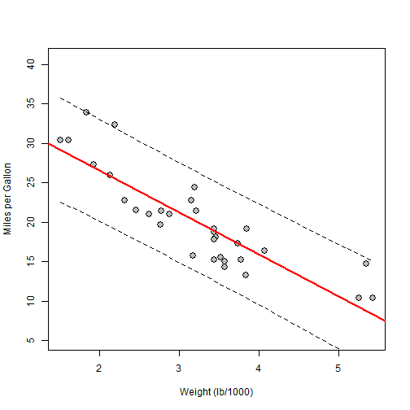

## 1. The App

This App just estimates mpg outcome (miles per gallon) of a hypothetic car, just by entering the value of one other dependent factor.
This factor can be either weight, displacement, rear axle ratio or horsepower.

You can enjoy the app at http://j-verdu.shinyapps.io/project/

---

## 2. Data estimation: regression

A linear regression is performed through R, using mtcars data.
Regression line and confidence intervals for prediction are shown in a plot, together with orginal data.
For instance this is an example of output using 'weight' as factor (index value 6 at cars dataset).

 

---

## 3. Data estimation: regression code

And this would be the code for the same example.


```r
data(mtcars)
cars<-mtcars
names(cars)[3:6]<-c("Displacement (cu.in.)", "Horsepower", "Rear_axle_ratio", "Weight (lb/1000)")
name<-names(cars)[6]
            datacars<-data.frame(mpg=cars$mpg,input=as.vector(cars[,6]))
            # fit model
            fit<-lm(mpg~input,data=datacars)
            # plot points and model
            plot(datacars$input,datacars$mpg, xlab=name, ylab='Miles per Gallon',
                 ylim=c(0.5*min(datacars$mpg),1.2*max(datacars$mpg)),col='black',
                 bg='grey',pch=21,cex=1.5)
            abline(fit,lwd=2,col=2)
            ## confidence interval lines
            newx <- seq(min(datacars$input), max(datacars$input), 0.1)
            newx2<-data.frame(input=newx)
            a <- predict(fit, newdata=newx2, interval="prediction")
            lines(newx, a[,2], lty=2)
            lines(newx, a[,3], lty=2)
```

 

---

## 4. Data estimation: prediction

A table with results is generated using this code at the 'server.R' file. A sample value of 4 as weight input is shown here


```r
topredict <- 5
topred2<-data.frame(input=topredict)
out <- predict(fit, newdata=topred2, interval="prediction")          
prediction<-cbind(topredict,out)
colnames(prediction)<-c(name,"MPG Prediction","Minimum MPG","Maximum MPG")
prediction<-round(prediction,digits=1)
prediction                
```

```
##   Weight (lb/1000) MPG Prediction Minimum MPG Maximum MPG
## 1                5           10.6         3.9        17.2
```


